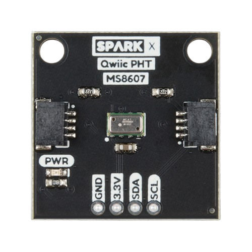

# MS8607-python-library
This is a Python library that tries to interface with the MS8607 sensor. 
## 💻 Materials
The SPX-16298 from SparkFun was used to test this library, but it should work with other boards. It could be purchased at [Mouser](https://www.mouser.es/ProductDetail/SparkFun/SPX-16298?qs=OlC7AqGiEDn97Tym7U9c%2FA%3D%3D).

     

## 🔧 Dependencies and Installation 
* Python == 3.7.11
* pigpiod == ????

## 🚀 Code
The project was tested in a Raspberry Pi 4, using the I2C communication protocol.

In the code folder, you can find the necessary code to run the test script called "test_spx.py". Consider that it is importing the necessary registers from another script called "SPX16298_regs.py"

## 📜 License
This project is released under the MIT 2.0 license.

## 📧 Contact
If you have any questions, please email antoniogalvanhernandez1998@gmail.com.

